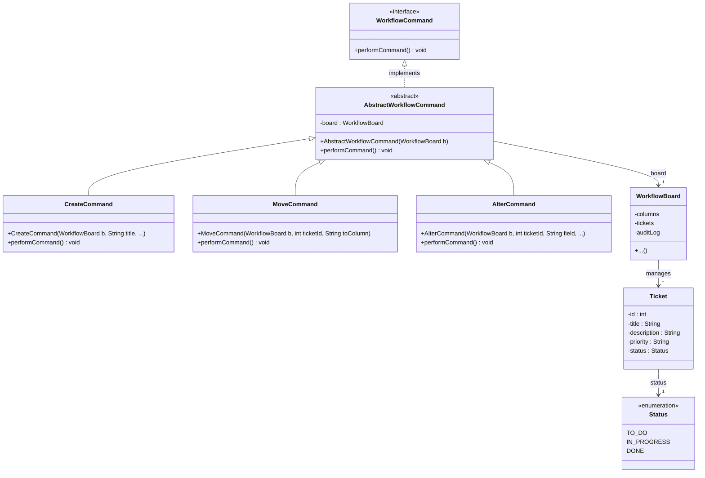

# Task 1: Workflow Management System


## Background

User stories are used in Agile software development to describe functionality from the end user's perspective. They are tracked using tickets on a board with columns representing different states, such as To Do, In Progress, and Done. You can read more about user stories and the Agile process [here](https://www.atlassian.com/agile/project-management/user-stories) and [here](https://agilealliance.org/glossary/user-stories/).

A newly-formed company called **ManageMyWorkflow** has hired you as a junior software developer. Your task is to create a workflow management system to manage the states of user stories within a software development project.

You can see an interactive example of a software development board [here](https://gemini.google.com/share/7e1779fd9b8c).

---

## Your Task

Implement the backend functionality of this system as a **console-menu-based Java application**. You must implement code for the following commands:

| Command    | Description                                          |
|------------|------------------------------------------------------|
| **Create** | Creates a new ticket and adds it to the To Do column |
| **Move**   | Moves a ticket from one column to another            |
| **Alter**  | Adds or edits specific information on a ticket       |

Tickets move between three states: **To Do**, **In Progress**, and **Done**.

Information must be stored for each ticket so that its current state is always known. At least three additional pieces of information relevant to a ticket must also be stored. It is up to you as the developer to decide what this information is.

You must also implement an **audit log** that records a history of all commands performed.

---

## MVP Requirements

Implement the application as a minimal viable product (MVP) with the following functionality:

1. **Audit log** — A data structure that is initially empty to represent the audit log.
2. **Command execution** — All three commands must be supported. The user must be able to specify details for each command (e.g., which column to move a ticket to, what information to update).
3. **Multiple commands per ticket** — A single ticket may have multiple commands performed on it. Each command must be logged as a separate entry in the audit log.
4. **Debug display** — Display the contents of all columns after every command execution.
5. **Audit log display** — The system must allow the user to display the audit log.

---

## UML Class Diagram

Your Java classes **must implement and match** the following class diagram. The design follows the [Command Design Pattern](https://en.wikipedia.org/wiki/Command_pattern).



> **Note:** The diagram may not contain all required fields and methods (e.g., getters, setters, and additional constructors). When a command is created, it is **not executed immediately** — the `performCommand()` method must be called to execute it.

---

## Getting Started

### Project Structure

```
src/
├── main/java/workflow/    ← Implement your classes here
└── test/java/workflow/    ← Automated tests (do not modify)
```

All classes must be placed in the `workflow` package.

### Building and Running

1. Open the project in **IntelliJ IDEA**.
2. Select **Trust Project** if prompted.
3. Right-click **pom.xml** and select **Add as Maven Project** (or select **Load Maven Project** when prompted).
4. Create your `Main` class with a `main()` method, then right-click it and select **Run**.

> **Note:** The project will not compile until you implement the required classes from the UML diagram. Read the provided test files to understand the expected class interfaces.

### Running Tests Locally

- Right-click individual test files in `src/test/java/workflow/` to run them.
- Or open **View → Tool Windows → Maven**, then double-click **Lifecycle → test**.

---

## Grading

Your submission is **automatically graded** when you push to GitHub via [GitHub Actions](https://docs.github.com/en/actions). Check the badge at the top of this page or the **Actions** tab for your results.

| Test             | Points | Description                              |
|------------------|--------|------------------------------------------|
| Structure        | 8      | Correct class hierarchy and interfaces   |
| Workflow         | 2      | Basic command functionality              |
| Hidden Tests     | 15     | Additional undisclosed test cases        |
| **Total**        | **25** |                                          |

---

## Resources

- [Command Design Pattern](https://en.wikipedia.org/wiki/Command_pattern) — The pattern your solution must follow
- [Understanding GitHub Actions](https://docs.github.com/en/actions/learn-github-actions/understanding-github-actions) — How the automated grading pipeline works
- [JUnit 5 User Guide](https://junit.org/junit5/docs/current/user-guide/) — The testing framework used in this project
- [Maven in 5 Minutes](https://maven.apache.org/guides/getting-started/maven-in-five-minutes.html) — The build tool used in this project
- [User Stories (Atlassian)](https://www.atlassian.com/agile/project-management/user-stories) — What user stories are
- [User Stories (Agile Alliance)](https://agilealliance.org/glossary/user-stories/) — Agile methodology overview
