<div class="header">
<strong>Nelson Mandela University</strong><br>
Faculty of Computing Sciences<br>
Dr Simone Beets
</div>

# Practical Assignment 2 — Task 1

## Workflow Management System

---

### Context

User stories are a core concept in Agile software development. They describe a piece of functionality from the end user's perspective and are tracked using tickets on a board with columns representing different states — for example, *To Do*, *In Progress*, and *Done*.

You can explore an interactive example of a development board [here](https://gemini.google.com/share/7e1779fd9b8c).

For further reading on user stories and Agile:

- [Atlassian — User Stories](https://www.atlassian.com/agile/project-management/user-stories)
- [Agile Alliance — User Stories](https://agilealliance.org/glossary/user-stories/)

---

### Scenario

A newly-formed company called **ManageMyWorkflow** has hired you as a junior software developer. Your first assignment is to build a workflow management system that manages the states of user stories within a software development project.

Your task is to implement the backend functionality of this system as a **console-menu-based Java application**.

---

### Requirements

#### Commands

You must implement the following commands:

| Command    | Description                                          |
|------------|------------------------------------------------------|
| **Create** | Creates a new ticket and adds it to the To Do column |
| **Move**   | Moves a ticket from one column to another            |
| **Alter**  | Adds or edits specific information on a ticket       |

#### Ticket States

Tickets can be moved between three states:

- **To Do**
- **In Progress**
- **Done**

Information must be stored for each ticket so that its current state in the system is always known. At least **three additional pieces of information** pertaining to a ticket must be stored. It is up to you as the developer to decide what that relevant information is.

#### Audit Log

You must create an audit log that keeps a history of the commands that were performed.

---

### Minimal Viable Product (MVP)

Implement the application as an MVP to demonstrate to the stakeholders of your company. The MVP must include the following functionality:

1. **Audit log initialisation** — A data structure that is initially empty to represent the audit log.

2. **Command execution** — All three commands must be fully supported. The user must be able to specify details for each command, for example stating which column to move a ticket to, or what information to update.

3. **Multiple commands per ticket** — A single ticket may have multiple commands performed on it. Each command must be logged as a separate entry in the audit log.

4. **Debug display** — After every command execution, display the contents of all columns for debugging purposes.

5. **Audit log display** — The system must allow the user to display the full audit log.

---

<div style="page-break-before: always;"></div>

### UML Class Diagram

The Java classes of your solution must implement and match the following UML class diagram:



The design follows the **Command Design Pattern**. You can find more information on this pattern [here](https://en.wikipedia.org/wiki/Command_pattern).

#### Important Notes

- The UML diagram **may not contain all** the fields and methods needed for the task (e.g., getters, setters, and constructors).

- When a command is **created**, it is **not performed immediately**. To perform a command, the `performCommand()` method must be called.

---

### Getting Started

Your assignment is hosted as a GitHub repository. It contains automated tests and a CI pipeline that will grade your submission when you push your code.

#### Project Structure

```
src/
├── main/java/workflow/    ← Implement your classes here
└── test/java/workflow/    ← Automated tests (do not modify)
```

All classes must be placed in the `workflow` package.

#### Building and Running

1. Open the project in **IntelliJ IDEA**.
2. Select **Trust Project** if prompted.
3. Right-click **pom.xml** and select **Add as Maven Project** (or select **Load Maven Project** when prompted).
4. Create your `Main` class with a `main()` method, then right-click it and select **Run**.

> The project will not compile until you implement the required classes from the UML diagram. Use the provided test files to understand the expected class interfaces.

#### Running Tests Locally

- Right-click individual test files in `src/test/java/workflow/` to run them.
- Or open **View → Tool Windows → Maven**, then double-click **Lifecycle → test**.

---

### Grading

Your submission is automatically graded when you push to GitHub. The grading pipeline runs a series of automated tests against your code. You can check your results by visiting the **Actions** tab in your repository.

| Test             | Points | Description                              |
|------------------|--------|------------------------------------------|
| Structure        | 8      | Correct class hierarchy and interfaces   |
| Workflow         | 2      | Basic command functionality              |
| Hidden Tests     | 15     | Additional undisclosed test cases        |
| **Total**        | **25** |                                          |

The visible tests verify that your classes follow the correct structure and that basic functionality works. The hidden tests evaluate the full behaviour of your commands, audit log, and edge case handling. You will not see the hidden test details — your implementation must be guided by the assignment requirements and UML diagram.

---

### Resources

| Resource | Description |
|----------|-------------|
| [Command Design Pattern](https://en.wikipedia.org/wiki/Command_pattern) | The pattern your solution must follow |
| [Understanding GitHub Actions](https://docs.github.com/en/actions/learn-github-actions/understanding-github-actions) | How the automated grading pipeline works |
| [JUnit 5 User Guide](https://junit.org/junit5/docs/current/user-guide/) | The testing framework used in this project |
| [Maven in 5 Minutes](https://maven.apache.org/guides/getting-started/maven-in-five-minutes.html) | The build tool used in this project |
